---
# HOW ARGUS WORKS

```mermaid
flowchart TD
    A[System Sleep<br>Ultra-Low Power<br>&lt;10 µA] --> B[Wake Tier 1<br>Every 3s via RTC]
    B --> C[Gatekeeper<br>Cortex-M4]
    C --> C1[MyBAD-Gatekeeper<br>16×184 Spectrogram<br>Binary Bird/No-Bird]
    C1 --> D{Bird Detected?<br>≥99% Recall}
    
    D -- No --> A
    D -- Yes --> E[Wake Tier 2<br>Cortex-M7]
    E --> F[Classifier<br>Cortex-M7]
    F --> F1[MynaNet<br>80×300 Spectrogram<br>10-Species ID]
    F1 --> G{Known Species?}
    
    G -- Yes --> H[Log Species + Timestamp<br>to SD Card]
    G -- No --> I[Save 3s Audio Clip<br>for Offline Analysis]
    H --> J[Power Down Tier 2<br>Return to Sleep]
    I --> J
    J --> A
    
    style C fill:#e3f2fd,stroke:#1565c0,stroke-width:2px
    style F fill:#e8f5e8,stroke:#2e7d32,stroke-width:2px
    style D stroke:#c62828,stroke-width:2.5px
    style A fill:#f5f5f5,stroke:#616161
```

---

## Operational Workflow  

| Phase | Tier 1 (Cortex-M4) | Tier 2 (Cortex-M7) | Power State |
|-------|--------------------|--------------------|-------------|
| **Sleep** | Deep sleep (RTC only) | Powered off | <10 µA |
| **Wake** | RTC triggers wake @ 3s | Remains off | ~5 mA (brief) |
| **Gatekeeper** | Processes 3s audio → 16×184 → inference | Off | ~8 mA |
| **Decision** | **No bird**: Return to sleep **Bird**: RPC trigger to Tier 2 | Wakes on RPC interrupt | Tier 1: 8 mA Tier 2: 120 mA |
| **Classification** | Sleeps during Tier 2 operation | 80×300 inference → species ID | Tier 2: 120 mA |
| **Logging** | Sleeps | Writes result to SD card | Tier 2: 90 mA |
| **Shutdown** | Sleeps | Powers down → signals Tier 1 | Transition to <10 µA |

> 💡 **Key innovation**: Tier 2 activates **<1% of the time** (only on bird detection), reducing average power by 100× versus always-on systems. A single 2,000 mAh battery enables **>2 years of continuous field operation**.

---

## Resource-Constrained Platform Tiers
|     Tier | Main Characteristic                                  | Typical Resources (Order of Magnitude) | Examples        |
|---------:|------------------------------------------------------|----------------------------------------|-----------------|
| 0        | Non-ML capable microcontroller                       | \<64 KB RAM, \<50 MHz                  | AVR, Cortex-M0+ |
| 1        | TinyML / low-end deep learning                       | 64–512 KB RAM, 50–200 MHz              | Cortex-M4      |
| 2        | High-end MCU deep learning (TinyML++)                | 512 KB–2 MB RAM, 200–600 MHz           | Cortex-M7      |
| 3        | Edge AI on general-purpose SBC                       | 1–8 GB RAM, multi-core GHz CPU         | Raspberry Pi   |
| 4        | Edge AI with hardware acceleration                   | 4–8 GB RAM + GPU / NPU                 | Jetson Nano    |

Proposed tiering to be published in future SLR paper.

